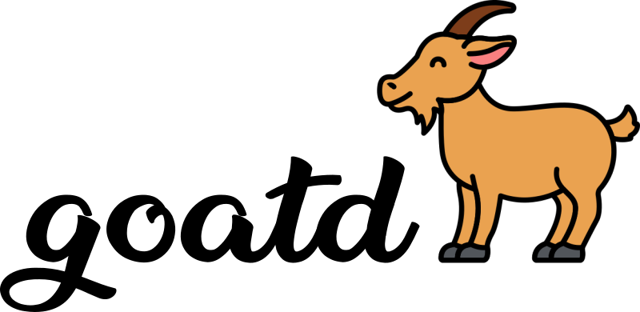

goatd (/ɡoʊtˈdiː/ ɡoʊt-DEE) is a task manager written in Go that
implements the GTD (Getting Things Done) methodology. The name was chosen
because it contains the letters G, T and D, because the server can run as a
daemon (hence the ending in 'd'), because Go applications frequently contain
'go' in their name and because goats are cute.

**WARNING: Right now the project is basically empty and useless. Everything you
see and read are ideas and plans.**

# Goals

* Simple to use
* Few features
* Few options
* Usable via the command line
* Usable via the web browser (goatd includes a HTTP server)
* Cross platform
* Single user
* Data is stored in plain-text MarkDown (.md) files
* Data is automatically Git backed

## Why those goals?

I lead a busy life and complex project are very hard to maintain. I also like
the UNIX philosophy of small tools that do one thing only but do it well.

Command line usage because it's fast and comfortable when you are used to it.

Web browser usage because graphical UIs are really nice to get an overview and
quickly drag and drop things around.

Cross platform to reach a wider user base and because Go makes it so easy.

Single user because that's what GTD is for.

Data is stored as plain-text MarkDown files because this way they can be edited
and read with other tools and you are not tying yourself long term to this
project.

Data is Git backed to provide backups. Most, if not all of the data will be
pure text and therefore so simple to compress that versioning it is basically
free. Also the project may use some Git features in the future e.g. determine
the age of a task by when the line was last modified. The fact that there is a
Git repository under the hood will be irrelevant and transparent to users who
don't want to interact with it.

# Contributions

Contributions are welcome. Just ensure that tests and builds keep running.
Please discuss any major changes beforehand, otherwise you may risk investing a
lot of effort only to be rejected (see project goals).

# Credits

* The goat icon in the logo is from flaticon.com with license "Free for
  personal and commercial purpose with attribution."
  [Link](https://www.flaticon.com/free-icon/goat_1998662).
* The font in the logo is "Blackberry Jam" from Billy Argel licensed as "Free
  for personal use".
  [Link](https://www.fontspace.com/blackberry-jam-font-f30707).
